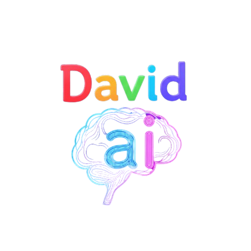

<p align="center">
  
  
  
  
  
  
</p>

# David AI 2B

David AI 2B is an AI-powered offline assistant developed by **Nexuzy Tech Pvt Ltd** and **David**. It supports:

- 🤖 Chat using Mistral-7B (offline)
- 👨‍💻 Code generation via StarCoder 1B
- 🎨 Image generation using Stable Diffusion v1.5
- 🧼 Image deblurring using Real-ESRGAN
- 🗣️ Voice command in Bangla, Hindi, English
- 💻 System control using offline voice

---

## 🖥️ System Requirements

| Component     | Minimum           |
|---------------|-------------------|
| CPU           | Intel i3 or above |
| RAM           | 8 GB              |
| GPU           | 4 GB (recommended)|
| Storage       | 80 GB free        |
| OS            | Windows 10/11 64-bit or Linux |

---

## ⚙️ Step-by-Step Installation

### 1. Set up Python Virtual Environment

```bash
python -m venv venv
venv\Scripts\activate   # On Windows
# OR
source venv/bin/activate   # On Linux/Mac
```

### 2. Clone the repository

```bash
git clone https://github.com/david0154/david-ai-2b.git
cd david-ai-2b
```

### 3. Install PyTorch (required, not in requirements.txt)

- **For CPU only:**
  ```bash
  pip install torch torchvision torchaudio --index-url https://download.pytorch.org/whl/cpu
  ```
- **For Nvidia GPU:**  
  [See official PyTorch instructions](https://pytorch.org/get-started/locally/)

### 4. Install All Other Dependencies

```bash
pip install --upgrade pip
pip install -r requirements.txt
```

---

## 🚀 First Run – Download All Models

```bash
python run.py
```

✅ This downloads all pretrained models into `models/`.  
Works 100% offline after the first run.

---

## 🏗️ Build Standalone `.exe` (Windows)

### 1. Install PyInstaller

```bash
pip install pyinstaller
```

### 2. Build `run.exe`

```bash
pyinstaller --noconfirm --onefile --windowed --icon=static/david.ico run.py
```

✅ Output:
```
dist/
└── run.exe
```

---

## 📦 Create Offline Installer (Windows)

### 1. Install Inno Setup

🔗 https://jrsoftware.org/isinfo.php

### 2. Add This `inno_setup.iss` in `installer/`

```ini
[Setup]
AppName=David AI 2B
AppVersion=1.0
DefaultDirName={pf}\DavidAI2B
DefaultGroupName=David AI 2B
OutputDir=dist
OutputBaseFilename=DavidAI2BInstaller
SetupIconFile=static\david.ico
Compression=lzma
SolidCompression=yes

[Languages]
Name: "english"; MessagesFile: "compiler:Default.isl"

[Files]
Source: "dist\run.exe"; DestDir: "{app}"; Flags: ignoreversion
Source: "models\*"; DestDir: "{app}\models"; Flags: recursesubdirs createallsubdirs

[Icons]
Name: "{group}\David AI 2B"; Filename: "{app}\run.exe"; WorkingDir: "{app}"
Name: "{group}\Uninstall David AI 2B"; Filename: "{uninstallexe}"
```

### 3. Compile Installer

```bash
installer\build.bat
```

✅ Output:
```
dist/
└── DavidAI2BInstaller.exe
```

---

## 📁 Included

- `requirements.txt`
- `README.md`
- `static/david.ico` and `static/davidai.png`

---

## 👨‍💻 Developers

Built by: **David**  
Organization: **Nexuzy Tech Pvt Ltd**

---

## 📝 License

This project is licensed under the [MIT License](LICENSE).
